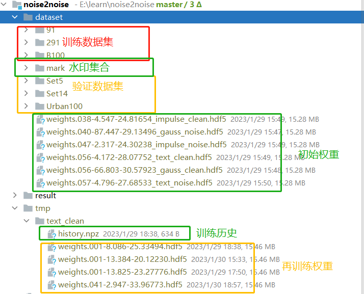
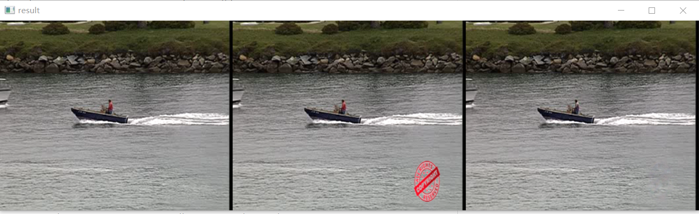
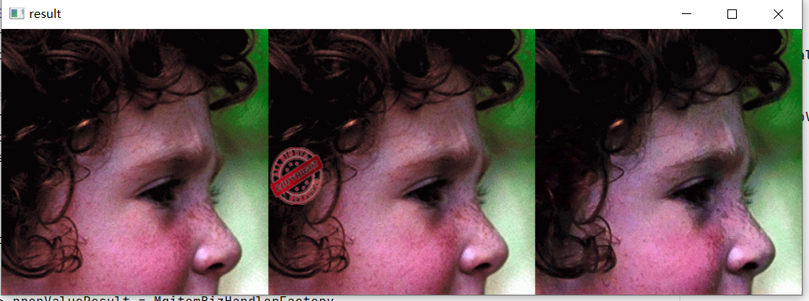
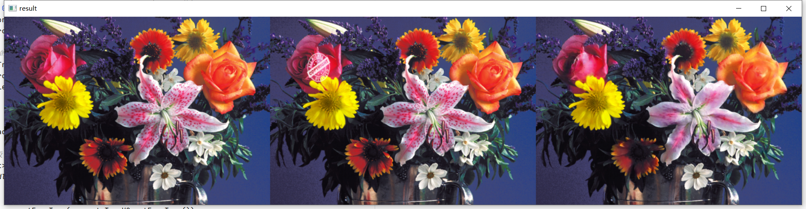
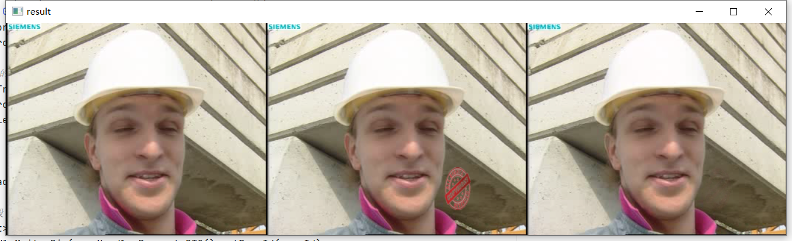

# Noise2Noise

## 简介

fork 自[yu4u/noise2noise](https://github.com/yu4u/noise2noise/blob/master/README.md).这个项目过程很详细,训练数据,加载权重的步骤就不赘述,需要的可以去原项目看一看.按照原项目的介绍下载权重和数据集,再加上自己的水印文件夹和导出权重,得到的项目结构如下:


pip依赖和原项目基本一致,只是keras和tensorflow的版本升到了2.10.0.可以按requirements.txt安装.
具体变动,除了改动一些tf版本兼容外,最主要的就是在原有的训练方法上,添加了指定若干水印再训练去除的方法.主要代码在`noise_model.py`的get_noise_model方法末尾.

```
elif tokens[0] == "mark":
    #水印图所在文件夹
    mark_dir=tokens[1]
    mark_imgs=[Image.open(mark_dir+"/"+mark_file) for mark_file in os.listdir(mark_dir)]
    def paste_mark(img):
        #复制背景图
        bg = Image.fromarray(img[:,:,::-1])
        # 随机选一张水印
        layer = mark_imgs[random.randint(0, len(mark_imgs)-1)]
        # 水印随机缩放
        layer_resize = (int(layer.size[0]*random.uniform(0.4, 1.5)),int(layer.size[1]*random.uniform(0.4, 1.5)))
        layer=layer.resize(layer_resize,Resampling.LANCZOS)
        layer_arr=np.copy(np.uint8(layer))
        # 水印随机透明度
        layer_arr[:,:,-1]=layer_arr[:,:,-1]*random.uniform(0.4,1.0)
        # 复制水印图的数组
        layer=Image.fromarray(layer_arr,mode="RGBA")
        # 在背景中的随机位置
        x, y = random.randint(0, bg.size[0] - layer.size[0]), random.randint(0, bg.size[1] - layer.size[1])
        # 水印叠加到底图
        bg.paste(layer, (x, y), layer)
        #RGB->BGR
        return np.uint8(bg.convert(mode="RGB"))[:,:,::-1]
    return paste_mark
```

## 训练方法

- 1 提前准备自己的水印png(注意一定要是RGBA格式,png不一定是RGBA!可以百度RGBA的定义),放在dataset/mark文件夹下.
- 2 在项目文件夹下执行如下命令.`python train.py --image_dir dataset/291 --test_dir dataset/Set14 --image_size 128 --lr 0.001 --source_noise_model mark,dataset/mark --target_noise_model clean --val_noise_model mark,dataset/mark --loss mae --output_path tmp/text_clean --weight dataset/weights.056-4.172-28.07752_text_clean.hdf5`.
 注意,--image_size 的值一定要大于所给定水印图的大小.比如给的水印图最大是64*128,--image_size 就要大于128.
 另外可以修改`--nb_epochs  --steps `来更改迭代次数.
 `--weight` 是初始化权重可以大大提升训练效率,`--output_path`指定的就是再训练权重导出的目录.
 `mark,dataset/mark`表示使用dataset/mark下的文件添加水印

## 测试方法

在项目文件夹下执行如下命令:
`python test_model --weight_file tmp/text_clean/weights.041-2.947-33.96773.hdf5 --image_dir dataset/Set14 --test_noise_model mark,dataset/mark`
其中`--weight` 用的是上一步导出的再训练权重文件.执行命令后就会跳出来一个弹窗,按回车翻到下一页.左中右分别是原图,水印图,去水印图.得到效果如下:






## TODOs

- [ ] 加一个批量导出方法

- [ ] 尝试unet结构

